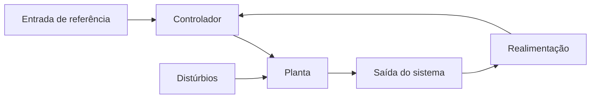

# Modelagem Matematica 

## Diagrama do sistema de controle

O sistema de controle de malha fechada serve para controlar uma variável de saída com base nas variáveis de entrada, onde a variável de saída é comparada com uma referência e a resultante do erro é ajustada com um comparador, buscando minimizar o erro entre a saída e a referência.

Algumas definições importantes incluem:

* `Variável Manipulada`: Essa é a variável onde o sistema tem controle direto, como a tensão de um motor.
* `Variável Controlada`: É a variável medida pelos sensores para ser controlada pelo sistema, como a velocidade de um motor, que pode ser medida por um encoder.
* `Malha Fechada`: É um sistema que possui controle da variável manipulada e serve para controlar a variável de controle.
* `Malha Aberta`: É um sistema que controla a variável manipulada independentemente da variável de controle, como um robô que executa uma tarefa repetitiva, não necessitando de um feedback pois somente executa a mesma tarefa.

Para criar um sistema de controle, primeiro é necessário um modelo matemático, também chamado de planta, que será responsável por realizar o controle do sistema. No entanto, no mundo real, as funções ou sistemas mudam com o tempo, e essa função que muda com o tempo é também chamada de cálculo diferencial, que pode ser não linear. Assim, a transformada de Laplace é utilizada para converter funções que mudam com o tempo em funções algébricas, que possam ser facilmente manipuladas.

---
