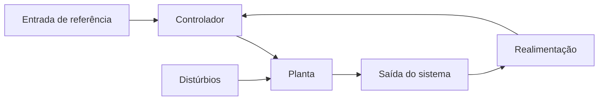
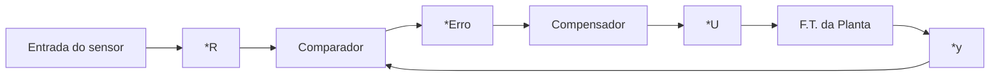

# Modelagem Matematica 

## Diagrama do sistema de controle

O sistema de controle de malha fechada serve para controlar uma variável de saída com base nas variáveis de entrada, onde a variável de saída é comparada com uma referência e a resultante do erro é ajustada com um comparador, buscando minimizar o erro entre a saída e a referência.

Algumas definições importantes incluem:

* `Variável Manipulada`: Essa é a variável onde o sistema tem controle direto, como a tensão de um motor.
* `Variável Controlada`: É a variável medida pelos sensores para ser controlada pelo sistema, como a velocidade de um motor, que pode ser medida por um encoder.
* `Malha Fechada`: É um sistema que possui controle da variável manipulada e serve para controlar a variável de controle.
* `Malha Aberta`: É um sistema que controla a variável manipulada independentemente da variável de controle, como um robô que executa uma tarefa repetitiva, não necessitando de um feedback pois somente executa a mesma tarefa.

Para criar um sistema de controle, primeiro é necessário um modelo matemático, também chamado de planta, que será responsável por realizar o controle do sistema. No entanto, no mundo real, as funções ou sistemas mudam com o tempo, e essa função que muda com o tempo é também chamada de cálculo diferencial, que pode ser não linear. Assim, a transformada de Laplace é utilizada para converter funções que mudam com o tempo em funções algébricas, que possam ser facilmente manipuladas.

---

# Caminho no lugar de raizes (LGR)

### **Analise de desempenho / Estabilidade por tabela**

Considere a Planta abaixo:

Vamos obter a FTMF F(s)

$$F(s) = \frac{\frac{8k}{s^3+7s^2+14s+8}}{1+(\frac{8}{s^3+7s^2+14s+8})*1}$$

$$F(s) = \frac{8k}{s^3+7s^2+14s+(8+8)}$$

A partir da F(s) vamos organizar o D(s) dispondo os coef. c/o seguinte arranjo:

| s^3 | 1 | 14     | 0 |
|-----|---|--------|---|
| s^2 | 7 | (8+8k) | 0 |
| s^1 | a | a2     | 12|
| s^0 | b | b2     | 12|
---

* A tabela acima é a chamada tabela de routh e, permitira encontramos a faixa de valores de k que atende o criterio de estabiblidade (todos os polos -> SPE)
* p/ ser estavel, todos sinais da primeira coluna deverm ser iguais (s/ ocorrer troca). No exemplo como temos -1 e -7 obrigatoriamente devemos ter `a1 > 0` e `b1 > 0`.
* Calculo de `a1`, `a2`, `b1` e `b2`:

$$a1 = \frac{-det*\begin{bmatrix} 
   1 & 14 \\
   7 & (8+8k) \\
   \end{bmatrix}}{7}$$

$$a1 = \frac{(8+8k)-(7*14)}{7}$$
---
$$a2 = \frac{-det*\begin{bmatrix} 
   1 & 0 \\
   7 & 0 \\
   \end{bmatrix}}{7}$$
$$a2 = 0$$
---
$$b1 = \frac{-det*\begin{bmatrix} 
   7 & (8+8k) \\
   a1 & 0 \\
   \end{bmatrix}}{a1}$$

$$b1 = \frac{(7*0-a1*(8+8k))}{a1}$$
---
$$b2 = \frac{-det*\begin{bmatrix} 
   7 & 0 \\
   a1 & 0 \\
   \end{bmatrix}}{a1}$$
$$b2 = 0$$

P/ ser Estável:

* **a1 > 0** 
$$\frac{98-8-8k}{7} > 0$$
$$14-1.14-1.14k > 0$$
$$-1.14k > -14+1.14$$
$$-1.14k > -12.85$$
$$k < 11.28$$

* **b1 > 0** 
$$8+8k > 0$$
$$8k > -8$$
$$k > -\frac{8}{8}$$
$$k > -1$$
